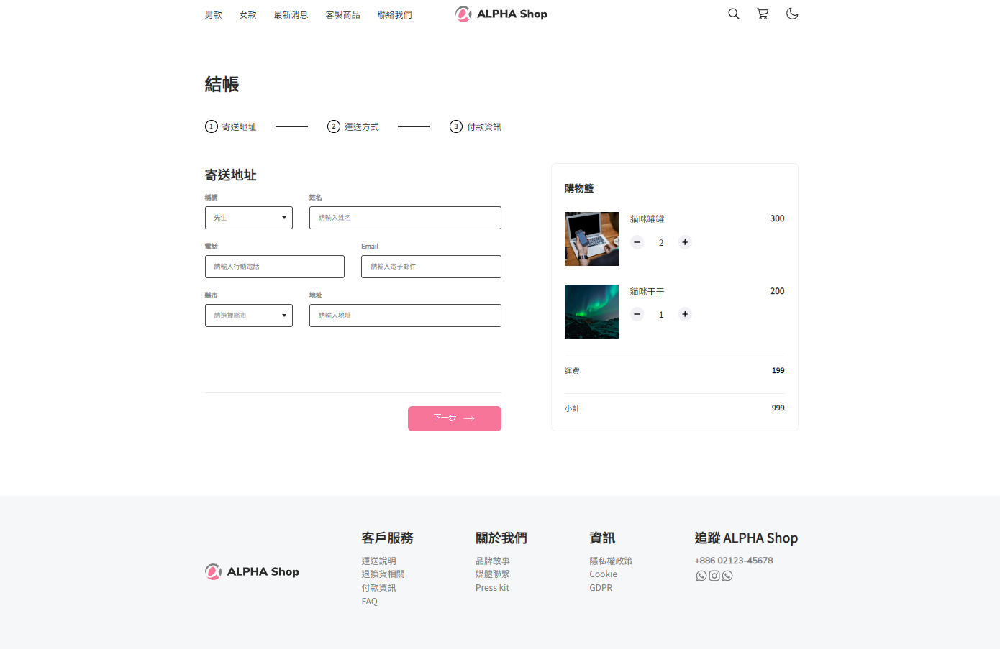

# Alpha Shop - Introduction



## 介紹

此專案是模擬電商平台結帳 UI，以此來練習 Component 的拆解、狀態管理以及其他 React 的練習。

## 功能

- 可以增減購物車內的商品，當達到免運標準將會折抵運費。
- 可以儲存表單資料。

## 開發工具

- React
- Scss

## 使用教學

1. 在 terminal 中 clone 此專案：

```
git clone https://github.com/Yuanuanuan/my-react-app.git
```

2. 在 terminal 中移動到此檔案後輸入：

```
npm install
```

3. 安裝完畢後，輸入：

```
npm start
```

4. 若顯示以下訊息代表成功運行：

```
伺服器已啟動，監聽在 http://localhost:3000
```

5. 將網址打開即可開始使用

```
http://localhost:3000
```

6. 若要關閉，按以下即可

```
Crtl+C
```
